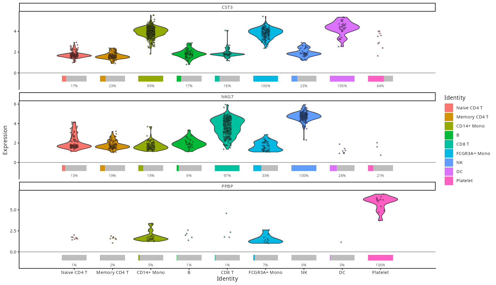
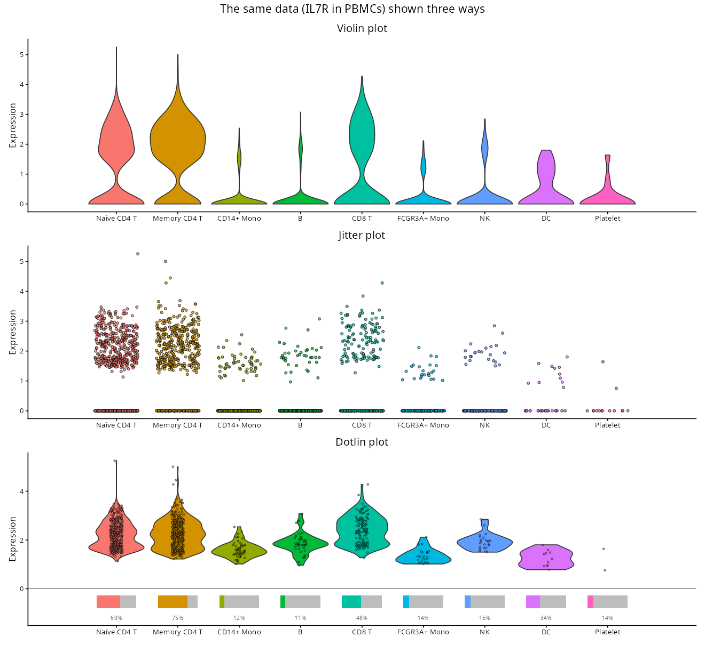

# dotlinplot



**dotlinplot** draws dotlin plots: faithful pictures of zero-inflated data such as single-cell gene expression. It works directly on [Seurat](https://satijalab.org/seurat/) and [SingleCellExperiment](https://bioconductor.org/packages/SingleCellExperiment/) objects, and on plain data frames.

## Why dotlin plots?

In single-cell data, most genes are detected in only some of the cells, so most expression values are zero. Common distribution plots struggle with this:

-   **Violin plots** are shaped mostly by the zeros. The cells that do express the gene are squeezed into a thin tail, and a group in which few cells express the gene can look much like one in which many do.
-   **Jitter plots** show every cell, but the zeros merge into a solid band, so the share of expressing cells is hard to judge, especially when groups differ in size.

A dotlin plot separates the two questions hidden in the data:

1.  **What share of the cells in each group express the gene?** A bar below zero: the grey bar stands for all cells in the group, and the coloured part for the expressing ones, with the percentage underneath. (This is the information a dot plot encodes as dot size.)
2.  **How strongly is the gene expressed in those cells?** A violin with points above zero, drawn from the non-zero values only.



In the violin and jitter plots above it is hard to tell that IL7R is expressed in 60–75% of CD4 T cells but in only 11–15% of monocytes, B cells and NK cells. The dotlin plot shows this directly, together with the expression levels in the expressing cells.

## Installation

```r
# install.packages("remotes")
remotes::install_github("Wajidiqbal1/dotlinplot")
```

ggplot2 and scales are installed automatically. Seurat and SingleCellExperiment objects work whenever those packages are installed.

## Usage

```r
library(dotlinplot)

# SeuratData::InstallData("pbmc3k")  # once, to get the example data
pbmc <- SeuratData::LoadData("pbmc3k", type = "pbmc3k.final")

dotlin_plot(pbmc, genes = c("CST3", "NKG7", "PPBP"))
```

For a Seurat object, cells are grouped by their identities (`Idents()`) and the log-normalised `"data"` layer is used, so nothing else is needed. Other inputs work the same way:

```r
# SingleCellExperiment: uses colLabels() and the "logcounts" assay by default
dotlin_plot(sce, genes = c("CST3", "NKG7", "PPBP"), category_col = "cell_type")

# Data frame: one row per cell, one numeric column per gene
dotlin_plot(df, genes = c("CST3", "NKG7", "PPBP"), category_col = "cell_type")
```

Only values above zero count as expressed, so use non-negative data such as log-normalised expression, not scaled data. A warning is given if negative values are found.

The result is a ggplot object, so it can be styled and saved as usual:

```r
library(ggplot2)

dotlin_plot(pbmc, genes = "CST3", title = "CST3") +
  theme(axis.text.x = element_text(angle = 45, hjust = 1))

ggsave("dotlin_plot.png", width = 8, height = 4)
```

## Arguments

| Argument         | Default | Description |
|------------------|---------|-------------|
| `object`         | ---     | Seurat object, SingleCellExperiment or data frame. |
| `genes`          | ---     | Genes to show, one panel each, in the order given. |
| `category_col`   | `NULL`  | Metadata column that holds the categories. `NULL` uses the identities (Seurat) or cell labels (SingleCellExperiment); required for data frames. |
| `palette`        | `NULL`  | Colours: a named vector or list mapping categories to colours, or unnamed colours in category order. `NULL` uses the ggplot2 hue palette. |
| `category_order` | `NULL`  | Categories to show, in x-axis order; categories not listed are left out. By default: factor levels, or sorted values. |
| `min_nonzero`    | `10`    | Smallest number of expressing cells for which a violin is drawn. |
| `layer`          | `NULL`  | Expression matrix: a Seurat layer (default `"data"`) or a SingleCellExperiment assay (default `"logcounts"`). |
| `assay`          | `NULL`  | Seurat assay to use (default `DefaultAssay(object)`). |
| `title`          | `NULL`  | Plot title. |
| `point_size`     | `0.7`   | Size of the points. |
| `point_alpha`    | `0.6`   | Opacity of the points. |
| `jitter_width`   | `0.1`   | Horizontal jitter of the points. |

`dotlin_plot()` returns a ggplot object.

## Reading the plot

| Element                   | Shows |
|---------------------------|-------|
| Grey bar                  | All cells in the category (100%). |
| Coloured part of the bar  | The share of cells with non-zero expression. |
| Percentage                | That share as a number. |
| Violin                    | The distribution of the non-zero values. |
| Points                    | The individual cells with non-zero expression. |

Categories with fewer than `min_nonzero` expressing cells show points but no violin.

## License

MIT. See [LICENSE.md](LICENSE.md).
