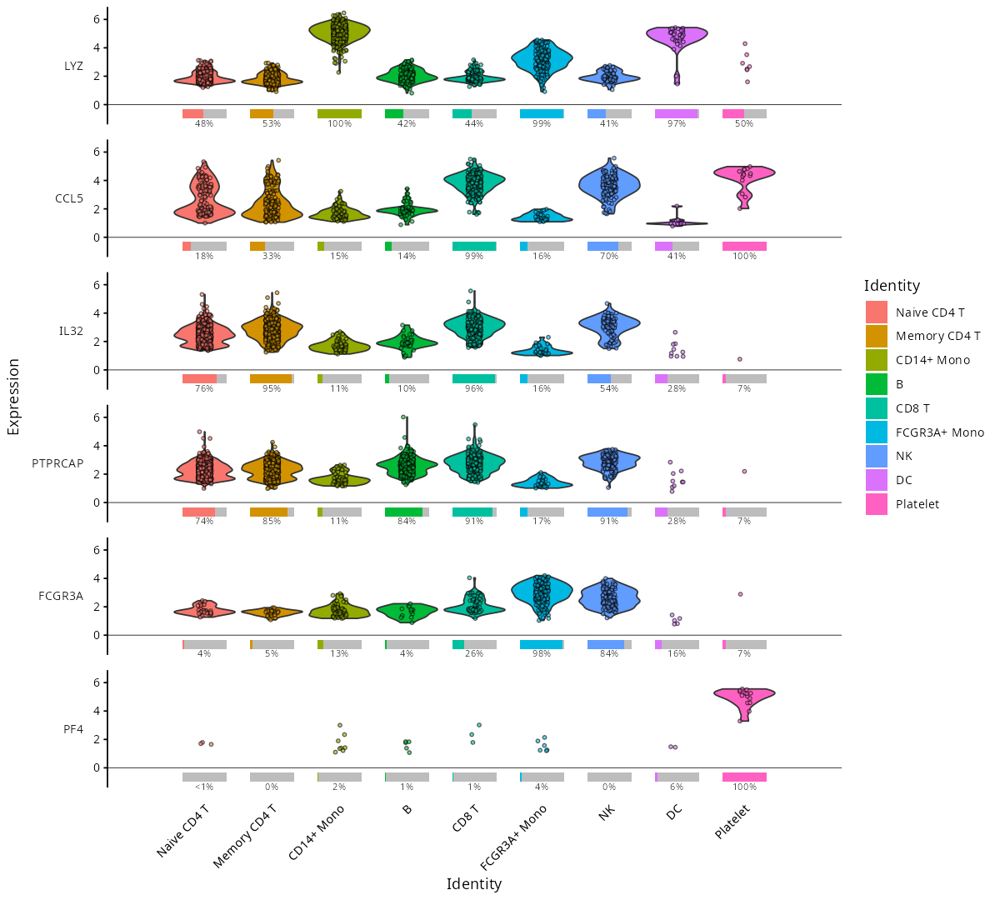
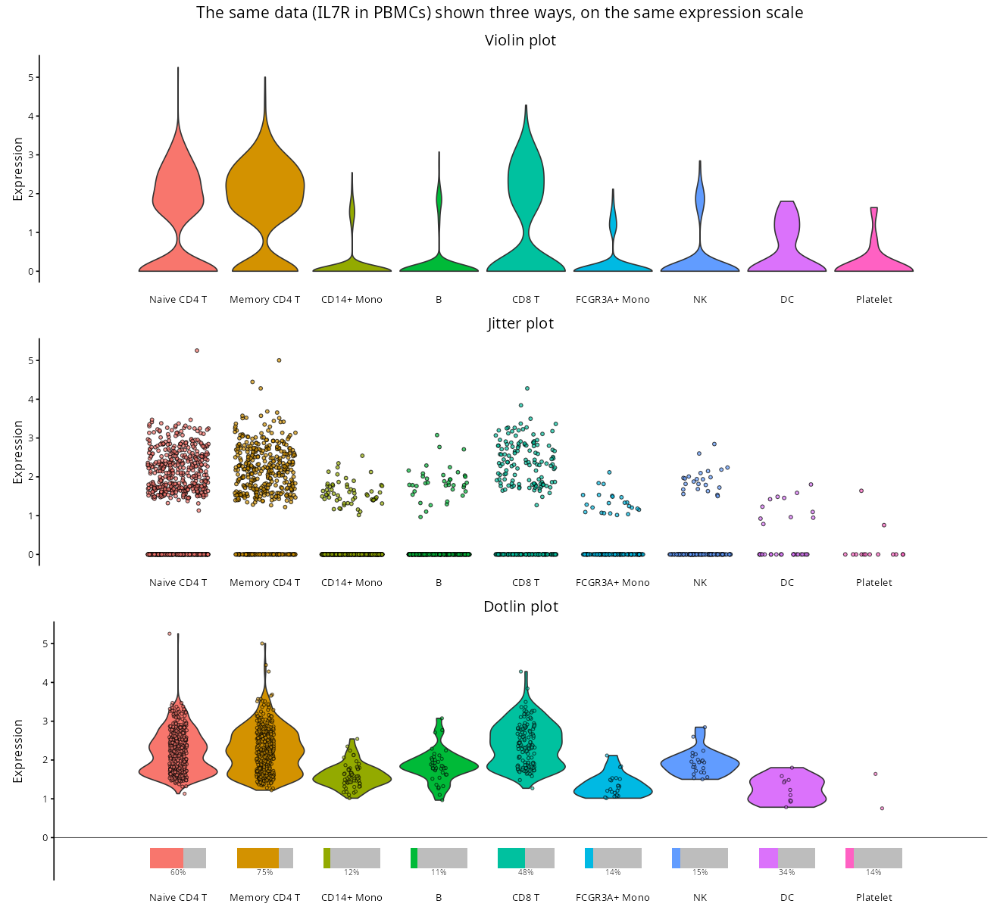

# dotlinplot



**dotlinplot** draws dotlin plots: faithful pictures of zero-inflated data such as single-cell gene expression. It works directly on [Seurat](https://satijalab.org/seurat/) and [SingleCellExperiment](https://bioconductor.org/packages/SingleCellExperiment/) objects, and on plain data frames.

## Why dotlin plots?

In single-cell data, most genes are detected in only some of the cells, so most expression values are zero. Common distribution plots struggle with this:

-   **Violin plots** are shaped mostly by the zeros. The cells that do express the gene are squeezed into a thin tail, and a group in which few cells express the gene can look much like one in which many do.
-   **Jitter plots** show every cell, but the zeros merge into a solid band, so the share of expressing cells is hard to judge, especially when groups differ in size.

A dotlin plot separates the two questions hidden in the data:

1.  **What share of the cells in each group express the gene?** A bar below zero that stands for all cells in the group (100%): its coloured part is the share that expresses the gene, its grey part the share that does not, with the percentage underneath. (This is the information a dot plot encodes as dot size.)
2.  **How strongly is the gene expressed in those cells?** A violin with points above zero, drawn from the non-zero values only. All violins have the same width, so their shapes can be compared even where few cells express the gene.



In the violin and jitter plots above it is hard to tell that IL7R is expressed in 60–75% of CD4 T cells but in only 11–15% of monocytes, B cells and NK cells. The dotlin plot shows this directly, together with the expression levels in the expressing cells.

## Installation

```r
# install.packages("remotes")
remotes::install_github("Wajidiqbal1/dotlinplot")
```

ggplot2 and scales are installed automatically. Seurat objects need SeuratObject 5.0 or later (installed with Seurat 5); SingleCellExperiment objects work whenever that package is installed.

## Usage

```r
library(dotlinplot)

# Example data: PBMC 3k, a public 10x Genomics dataset of blood cells, in the
# version from Seurat's clustering tutorial (2,638 cells, labelled with 9 cell
# types). Anyone can download the same object; install it once (about 90 MB):
# remotes::install_github("satijalab/seurat-data")
# SeuratData::InstallData("pbmc3k")
pbmc <- SeuratData::LoadData("pbmc3k", type = "pbmc3k.final")

genes <- c("LYZ", "CCL5", "IL32", "PTPRCAP", "FCGR3A", "PF4")
dotlin_plot(pbmc, genes)
```

With your own data, use your own Seurat object instead of `pbmc`. Cells are grouped by their identities (`Idents()`) and the log-normalised `"data"` layer is used, so nothing else is needed. Objects made with Seurat v3 or v4 need updating first: `pbmc <- SeuratObject::UpdateSeuratObject(pbmc)`. Other inputs work the same way:

```r
# SingleCellExperiment: uses colLabels() and the "logcounts" assay by default
dotlin_plot(sce, genes, category_col = "cell_type")

# Data frame: one row per cell, one numeric column per gene
dotlin_plot(df, genes, category_col = "cell_type")
```

Only values above zero count as expressed, so use non-negative data such as log-normalised expression, not scaled data. A warning is given if negative values are found.

All genes share one y-axis, so they can be compared directly. For raw counts (`layer = "counts"`), where genes can differ a lot in range, `shared_y = FALSE` gives each gene its own y-axis.

The result is a ggplot object, so it can be styled and saved as usual. The genes are stacked on top of each other, so give the figure **3 inches of height plus 1 inch per gene**. A fixed small size squeezes the violins as soon as there are several genes. The percentages are drawn at 7 pt; when a figure is too small for that (many genes, many categories or a narrow figure), they are drawn just small enough not to overlap, and a larger figure brings them back to full size.

```r
library(ggplot2)

# The categories are already named on the x-axis, so the legend can go
p <- dotlin_plot(pbmc, genes) +
  theme(legend.position = "none")

ggsave("dotlin_plot.png", p, width = 8, height = 3 + length(genes))
```

## Arguments

| Argument         | Default | Description |
|------------------|---------|-------------|
| `object`         | ---     | Seurat object, SingleCellExperiment or data frame. |
| `genes`          | ---     | Genes to show, one panel each, in the order given. |
| `category_col`   | `NULL`  | Metadata column that holds the categories. `NULL` uses the identities (Seurat) or cell labels (SingleCellExperiment); required for data frames. |
| `palette`        | `NULL`  | Colours: a named vector or list mapping categories to colours, or unnamed colours in category order. `NULL` uses the ggplot2 hue palette. |
| `category_order` | `NULL`  | Categories to show, in x-axis order; categories not listed are left out. By default: factor levels, or sorted values (numbers stored as text, such as cluster numbers, in numeric order). |
| `min_nonzero`    | `10`    | Smallest number of expressing cells (not a percentage) for which a violin is drawn. |
| `shared_y`       | `TRUE`  | All genes share one y-axis. `FALSE` gives each gene its own y-axis (e.g. for raw counts). |
| `layer`          | `NULL`  | Expression matrix: a Seurat layer (default `"data"`) or a SingleCellExperiment assay (default `"logcounts"`). |
| `assay`          | `NULL`  | Seurat assay to use (default `DefaultAssay(object)`). |
| `title`          | `NULL`  | Plot title. |
| `point_size`     | `0.7`   | Size of the points. |
| `point_alpha`    | `0.6`   | Opacity of the points. |
| `jitter_width`   | `0.1`   | Horizontal jitter of the points. |

`dotlin_plot()` returns a ggplot object.

## Reading the plot

| Element                   | Shows |
|---------------------------|-------|
| Whole bar                 | All cells in the category (100%). |
| Coloured part of the bar  | The share of cells with non-zero expression. |
| Grey part of the bar      | The share of cells with zero expression. |
| Percentage                | The coloured share as a number; `<1%` or `>99%` when rounding would hide a few cells. |
| Violin                    | The distribution of the non-zero values. All violins have the same width; the share of expressing cells is shown by the bar. |
| Points                    | The individual cells with non-zero expression. |

### When is a violin drawn?

A violin is drawn only when **at least 10 cells** in a category express the gene (`min_nonzero = 10`). With fewer, the category shows its points but no violin, because a violin estimated from so few cells would mostly show smoothing, not data.

This is a number of cells, not a percentage, so a small cell type can have a high percentage and still no violin:

| Example (PBMC 3k, first image) | Expressing cells | Violin? |
|-------------------------------|------------------|---------|
| LYZ in platelets              | 50% of 14 cells = 7 cells | No, only 7 cells |
| IL32 in DCs                   | 28% of 32 cells = 9 cells | No, only 9 cells |
| FCGR3A in naive CD4 T         | 4% of 697 cells = 26 cells | Yes |

Every expressing cell is always drawn as a point, so nothing is hidden. To draw violins from fewer cells, lower `min_nonzero`, for example `dotlin_plot(pbmc, genes, min_nonzero = 5)`.

## License

MIT. See [LICENSE.md](LICENSE.md).
